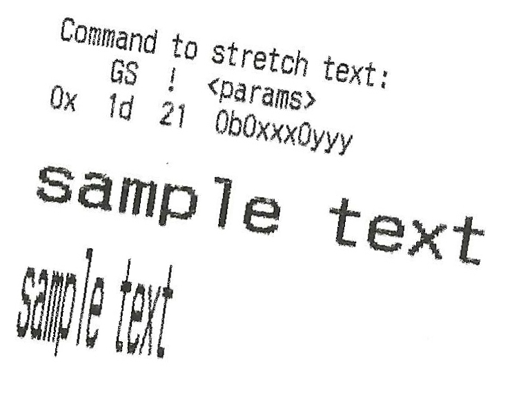
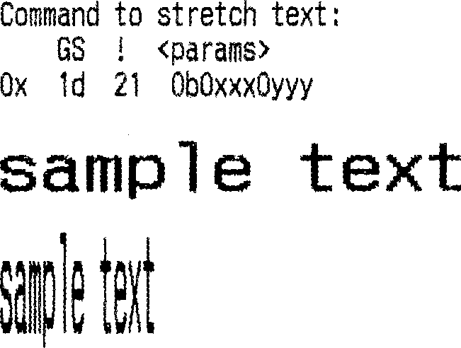

# deskew-text

Automatically straighten scanned images of text.

### How to run

1. Install [uv](https://docs.astral.sh/uv/getting-started/installation/) (e.g. `brew install uv`)
1. `cd` into this directory
1. `uv run main.py -i samples/in1.jpg -o out.png`
