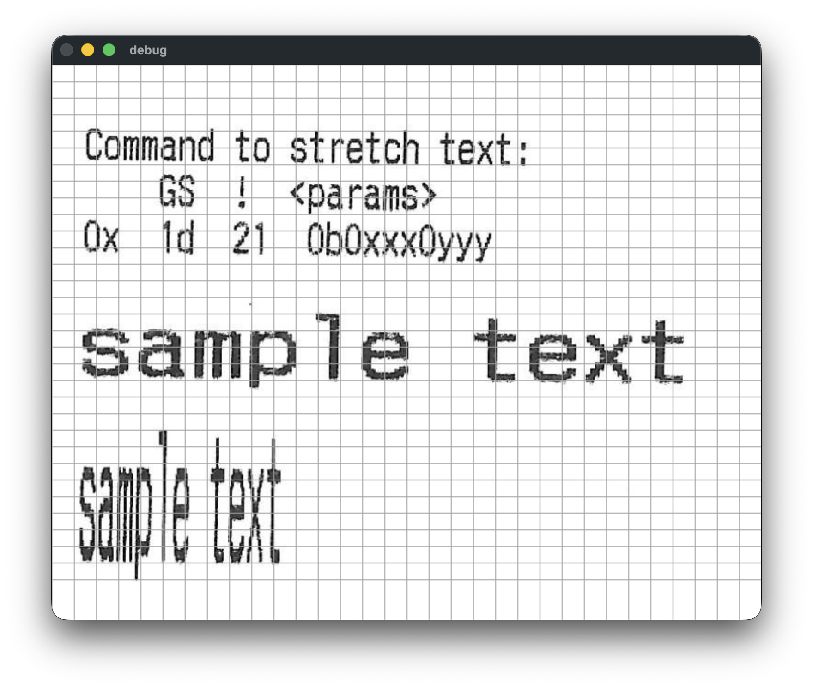
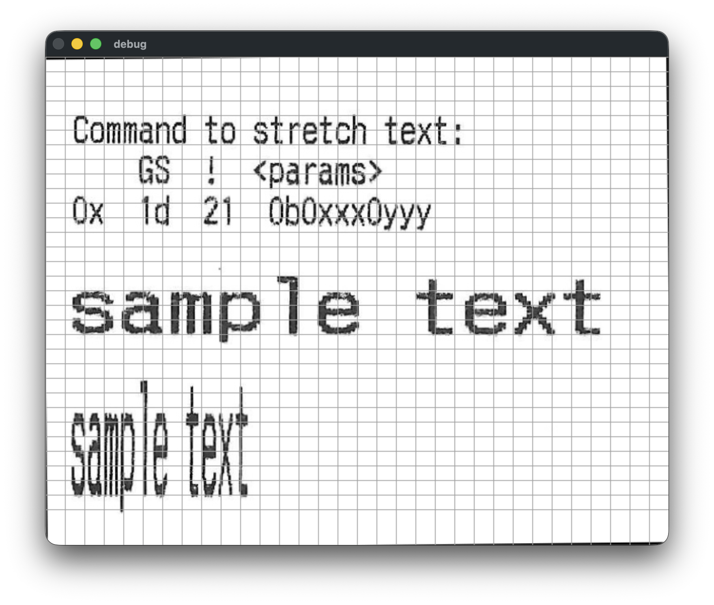

# deskew-text

Automatically straighten scanned images of text.

Before

After

### How to run

1. Install [uv](https://docs.astral.sh/uv/getting-started/installation/) (e.g. `brew install uv`)
1. `cd` into this directory
1. `uv run main.py`
